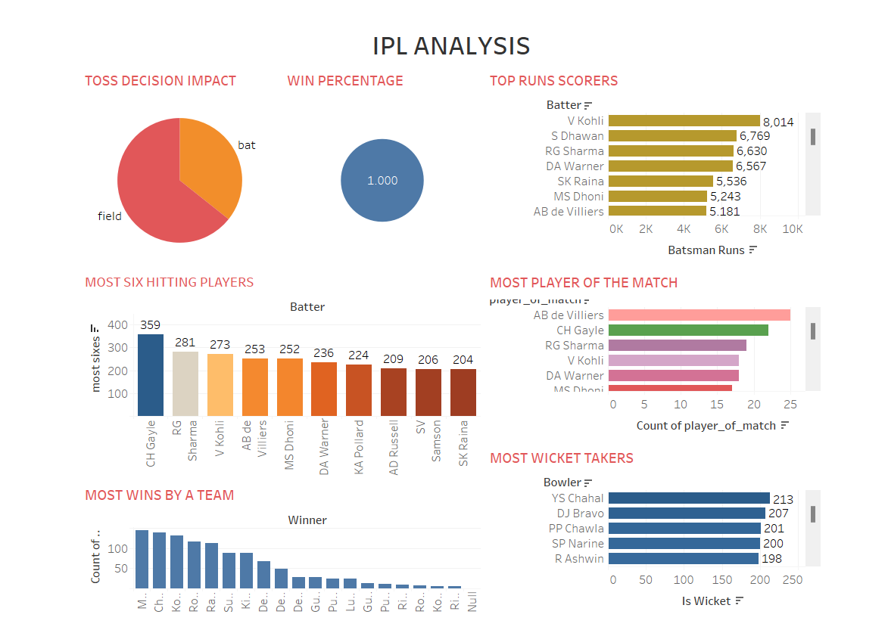

📌 Overview
This project provides a data visualization dashboard for IPL (Indian Premier League) analysis using Tableau. It includes insights into player performances, team statistics, and match results, enabling a better understanding of IPL trends.

Final preview

📊 Key Insights & Visualizations
Top Run Scorers – Visualizes the highest run-getters in IPL history.
Most Player of the Match Awards – Shows players with the most "Player of the Match" awards.
Most Wicket Takers – Highlights the bowlers with the most wickets.
Most Wins by a Team – Displays teams with the highest number of wins.
Toss Decision Impact – Analyzes how toss decisions (bat/field) influence match outcomes.
Most Six-Hitting Players – Shows the batsmen with the most sixes in IPL history.

📂 Files Included
IPL_Analysis.twbx – Tableau packaged workbook containing all dashboards.
IPL_Dataset.csv – Dataset used for analysis (if available).
README.md – Project documentation.

🛠 Tools Used
Tableau – For data visualization.
Microsoft Excel / CSV – For data preprocessing.

🚀 How to Use
Download the IPL_Analysis.twbx file.
Open it in Tableau Public or Tableau Desktop.
Interact with the dashboard to explore IPL insights.
